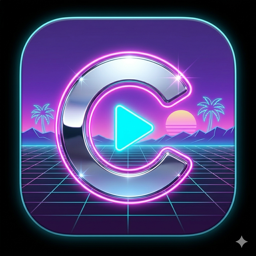

<p align="center">
  
</p>

<h1 align="center">Cadence</h1>

<p align="center"><em>A native macOS YouTube Music player that doesn't get in your way.</em></p>

> **Cadence is an unofficial YouTube Music player for macOS. It is not affiliated with, endorsed by, or sponsored by Google or YouTube.**

> **Cadence** *(n.)* — the rhythmic flow of a sequence; in music, a chord progression that resolves a phrase. Felt right for an app whose only job is to keep your music going.

## Why

There's no official YouTube Music app for macOS. Browser tabs get killed, buried, and steal the media keys away from any other audio you might be playing. Existing third-party apps push ads. Cadence wraps `music.youtube.com` in a clean native window, hooks it into the system media stack (Now Playing, media keys, headphone remotes), and otherwise stays out of your way.

## Features

- 🎵 Native window hosting the official YouTube Music web app
- 🎛 Works with macOS media keys, AirPods, Bluetooth headphones, and Control Center *Now Playing*
- 📌 Menubar mini-player with current-track info and transport controls
- 🔐 Stays logged in across launches (cookies persist via `WKWebsiteDataStore`)
- 🚫 No ad injection, no scraping, no API misuse — works best with **YouTube Music Premium** for an ad-free experience
- 🎨 Built with SwiftUI, macOS 14+

## Requirements

- macOS 14 (Sonoma) or later
- A Google account with access to YouTube Music
- *(Recommended)* YouTube Music Premium for ad-free playback

## Install

Cadence is distributed as a `.zip` from GitHub Releases. It is **not signed with an Apple Developer ID** (yet), so the first launch requires one extra click to get past macOS Gatekeeper.

### Step 1 — Download

Go to the [latest release](https://github.com/arnoudhgz/cadence/releases/latest) and download `Cadence.zip` from the *Assets* section.

### Step 2 — Move to Applications

1. Open your **Downloads** folder.
2. Double-click `Cadence.zip` to unzip it — you should now see `Cadence.app`.
3. Drag `Cadence.app` into your **Applications** folder.

### Step 3 — First launch (one-time Gatekeeper bypass)

Because the app is unsigned, **double-clicking `Cadence.app` will be blocked the first time**. macOS shows a dialog like *"Cadence cannot be opened because Apple cannot check it for malicious software"*. The workaround takes 5 seconds and is only needed once:

1. Open `Applications` in Finder.
2. **Right-click** (or Ctrl-click) `Cadence.app` → choose **Open**.
3. A new dialog appears with the same warning but now with an **Open** button — click it.
4. Cadence launches. Every subsequent launch is normal — double-click, ⌘-Space + "Cadence", Dock click, all work.

> If you accidentally double-clicked first and saw the *"cannot be opened"* dialog with only a "Move to Bin" button, just dismiss it and then follow the right-click → Open path above. macOS will remember your choice.

### Step 4 — Log in

On first launch, Cadence opens `music.youtube.com` and asks you to sign in with your Google account. Your login persists across launches.

## Controls

### Inside the app

Use YouTube Music's own keyboard shortcuts (space to pause, ←/→ to seek, etc.) — Cadence doesn't intercept them.

### Mac media keys (top row of any Apple keyboard)

| Key | Action |
|---|---|
| **F7** | Previous track |
| **F8** | Play / pause |
| **F9** | Next track |

These work even when Cadence is in the background. If you have other media apps running (Spotify, Music.app, browser tabs playing audio), macOS routes the key to whichever app played audio most recently — close the others or pause them if you want Cadence to win.

### AirPods, AirPods Pro, AirPods Max

| Gesture | Action |
|---|---|
| **Single click** (stem or button) | Play / pause |
| **Double click** | Next track |
| **Triple click** | Previous track |
| **Press-and-hold** | Siri / noise control (system default, not Cadence) |

### Other Bluetooth / wired headsets with inline remote

Any headset that sends standard *AVRCP* commands (the Bluetooth media protocol) or an inline-remote play/pause click will work — Cadence accepts the same `play`, `pause`, `next`, `previous`, and *seek-to-position* commands as Apple Music does, via `MPRemoteCommandCenter`. If your headset's button maps to one of those, it will route through.

### Control Center "Now Playing"

The macOS *Now Playing* module (in Control Center on macOS 14+, or the menubar widget) shows the current track, artwork, and a scrubber. Scrubbing in there seeks Cadence.

### Menubar mini-player

Click the music-note icon in the right side of the menubar to get a compact player with:

- Current track + artist + artwork
- Play / pause / previous / next buttons
- *Show Cadence* (reopens the main window if it was closed)
- *Quit*

## Build from source

```bash
git clone https://github.com/arnoudhgz/cadence.git
cd cadence

# One-time tooling install
brew install xcodegen

# Generate the Xcode project
xcodegen generate

# Open in Xcode and Run, or build from CLI:
xcodebuild -project Cadence.xcodeproj -scheme Cadence -configuration Debug build
```

**Requires full Xcode** (the Mac App Store one, not just Command Line Tools). Verify with `xcodebuild -version` before running the steps above.

To regenerate the app icon from `icon-source.png` (1024×1024 PNG at the repo root):

```bash
./scripts/generate-app-icon.sh
```

This rebuilds `Cadence/Resources/Assets.xcassets/AppIcon.appiconset/` from a single source PNG using `sips`.

## Support

If Cadence makes your day a little better, [buy me a coffee on Ko-fi ☕](https://ko-fi.com/arnoudhgz). Not required, never paywalled — purely optional.

## Status

Early development. The first tagged release will be `v0.1.0`. See [CHANGELOG.md](CHANGELOG.md) for what's in flight.

## License

[MIT](LICENSE) © [Arnoud Beekman](https://github.com/arnoudhgz).
